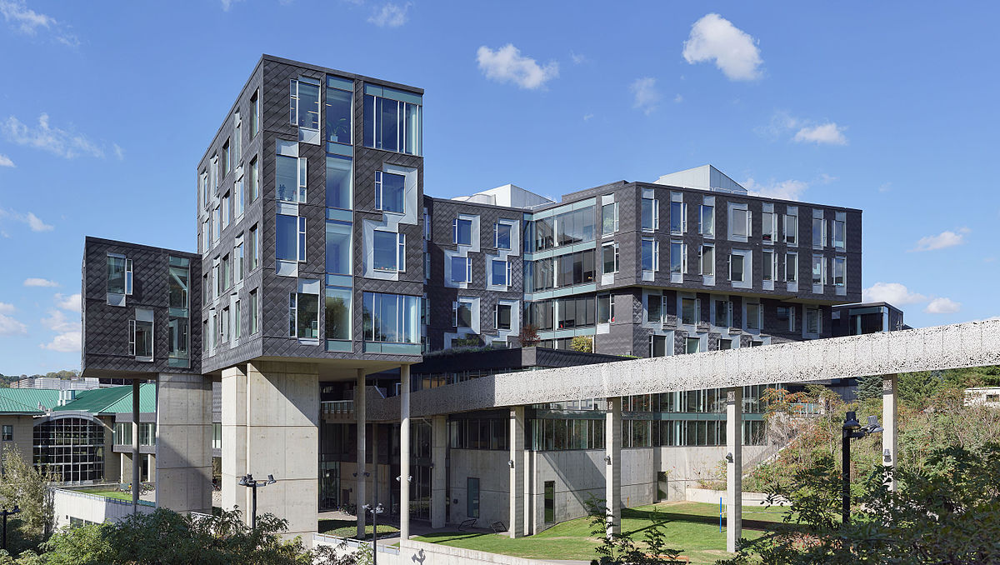
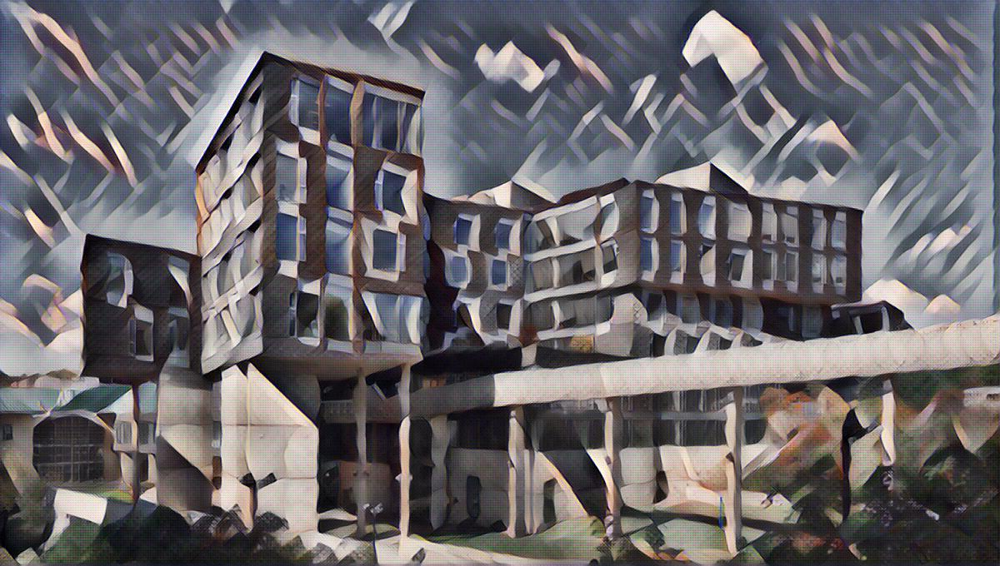

# neural-style
This repository contains Theano+Keras implementations of two algorithms for artistic style transfer. The algorithms can be used to mix the content of an image with the style of another image. For example, here is a photograph of the Gates Center at Carnegie Mellon Univeristy rendered in the style of Francis Picabia's *Udnie*. Pre-trained models, and additional examples can be found [on my website](https://www.cs.cmu.edu/~jkoushik/neural_style.html).

<p align="center">
    
    
    
</p>

There are two available implementations. `neural_style/slow_neural_style` contains the optimization based approach described in [A Neural Algorithm of Artistic Style](https://arxiv.org/abs/1508.06576) by Leon A. Gatys, Alexander S. Ecker, and Matthias Bethge. The algorithm is very general, in the sense that it can combine arbitrary content and style images, but the generation process is slow - it can take several minutes to generate a reasonably sized image. The implementation here mostly follows the original algorithm, except for a few details. There is an additional total-variation loss term, and the optimization is perfomed with Adam instead of L-BFGS.

`neural_style/fast_neural_style` is based on the feed-forward approach described in [Perceptual Losses for Real-Time Style Transfer and Super-Resolution](https://arxiv.org/abs/1603.08155) by Justin Johnson, Alexandre Alahi, and Fei-Fei Li. It also incorporates the instance-normalization trick presented by Dmitry Ulyanov, Andrea Vedaldi, and Victor Lempitsky in [Instance Normalization: The Missing Ingredient for Fast Stylization](https://arxiv.org/abs/1607.08022). The algorithm generates styled images in real-time with a single pass through a convolutional neural network. However, this comes with some loss in flexibility. A separate model must be trained for each style image. Regardless, since (in my opinion), the final results are much more visually appealing, I use this method to generate all examples. Again, there are minor technical differences compared to the original models - refer to `neural_style/fast_neural_style/transformer_net.py` for the details.

## Requirements
The program is written in Python, and uses [Theano](http://deeplearning.net/software/theano), [Keras](https://keras.io), [Scipy](https://www.scipy.org), and [tqdm](https://github.com/tqdm/tqdm). For Keras, you need to install a slightly modified version. You can do this using: `pip install --upgrade git+https://github.com/jayanthkoushik/keras.git`. Instructions for installing the other packages can be found on their respecive websites. A GPU is not necessary, but can provide a significant speed up. There are [additional requirements](http://deeplearning.net/software/theano/tutorial/using_gpu.html) to use a GPU.

## Usage
### Optimization based approach
The general usage is
```bash
python neural_style/slow_neural_style/slow_neural_style.py --content-image </path/to/content/image> --style-image </path/to/style/image> --output-image </path/to/output/image>
```
The resulting image will be written to the path specified by `--output-image`. There are additional command line arguments to customize the behavior:
* `--content-size`: resize the content image such that its longest side is this value before applying the style. The output image will have the same size. Setting a smaller size will speed up generation, and also consume less memory. The default (`None`) is to not resize.
* `--style-size`: resize the style image as above before extracting its features. This option can be used to control the scale of transfered features. The default (`None`) is to not resize.
* `--model`: use the specified model to extract features. Choices are `vgg16`, `vgg19`, and `resnet50`. The default is `vgg16`.
* `--content-layer`: use this layer to match the content. The possible values depend on the model, and the exact choices can be found by referring to the specific files on the [Keras repository](https://github.com/fchollet/keras/tree/master/keras/applications). The default value is `block2_conv2`
* `--style-layers`: use these layers to match the style. Specify a space separated list of values following the same conventions as for the content layer. The default value is `block1_conv2 block2_conv2 block3_conv3 block4_conv3`.
* `--content-weight`: use this weight for content reconstruction. Default value is 4.
* `--style-weight`: use this weight for style reconstruction. Default value is 5e-4.
* `--tv-weight`: use this weight for total-variation regularization. Default value is 1e-4.
* `--iterations`: run the optimization for this many iterations. Default value is 500.
* `--lr`: use this learning rate for the Adam optimizer. Default value is 10.
* `--lr-decay`: decay the learning rate linearly with this constant. If this value is *x*, and the initial learning rate is *r*, then the learning rate after *t* iterations is given by *r*/(1 + *tx*). The default value is 5e-3.
* `--normalize-gradient`: normalize the gradient to have unit L1 norm. The default is to not normalize the gradient.

### Feed-forward approach
The feed-forward approach requires training a model for a style before it can be used to generate images. To train a model, you need a dataset of images. The pre-trained models were trained using [MSCOCO](http://mscoco.org). The general usage is
```bash
python neural_style/fast_neural_style/fast_neural_style.py train --train-dir </path/to/training/images> --val-dir </path/to/validation/images> --style-image </path/to/style/image> --output-dir </path/to/output/directory>
```
There are several command line arguments. Many arguments are the same as for the optimization approach, and you can refer to the script for default values. The new options are:
* `--train-iterations`: train for this many iterations. The default is 40000 (about 2 epochs on MSCOCO with the default batch size).
* `--val-iterations`: use this many iterations for every validation run. The default is 10.
* `--val-every`: validate after this many iterations. The default is 1000.
* `--batch-size`: use this many images for each batch of stochastic gradient descent. The default is 4.
* `--perceptual-model`: extract perceptual features from this model. This option is the same as `--model` in the optimization approach. The default value is `vgg19`.
* `--test-image`: during every validation run, evaluate on this image and save the result. The default (`None`) is to not use any test image.
* `--test-size`: resize the test image as described for the optimization approach. The default (`None`) is to not resize.

The training script will write files to the output directory. Results on the test image (if provided) will be available as `test_iter_<iterations>.jpg`. After training is complete, training and validation losses will be written to `train_losses.pkl` and `val_losses.pkl` respectively, and the final model will be written to `model.h5`. You can also find pre-trained models [here](https://www.cs.cmu.edu/~jkoushik/neural_style.html). To evaluate a trained model on a new image, the usage is
```
python neural_style/fast_neural_style/fast_neural_style.py eval --content-image </path/to/content/image> --output-image </path/to/output/image> --model </path/to/model/file>
```
You can also resize the content image as before with the `--content-size` option. Although the actual image generation takes not more than a few hundred milliseconds, loading the model can take a few seconds. If you want to style many images, it will be faster to use the provided Jupyter notebook `playground.ipynb`. This loads a specified model, and you can use it to style images on disk, or the web.

