# neural-style
This is a Theano implementation of the [neural style algorithm](https://arxiv.org/abs/1508.06576) by Leon A. Gatys, Alexander S. Ecker, and Matthias Bethge. The algorithm can be used to mix the content of an image with the style of another image. For example, here is a photograph of the Gates Center at Carnegie Mellon University rendered in the style of Pablo Picasso's *Girl with a Mandolin*.

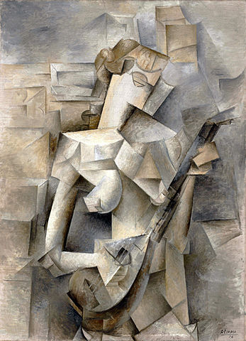
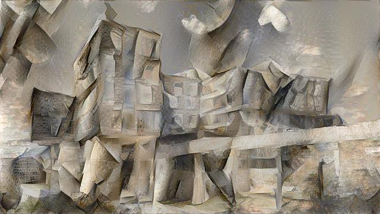

## Requirements
The program depends on [Caffe](http://caffe.berkeleyvision.org), [Theano](http://deeplearning.net/software/theano/), [Numpy](http://www.numpy.org), [Scipy](https://www.scipy.org), and [tqdm](https://github.com/tqdm/tqdm); instructions for installing these can be found on their respective websites. A GPU is not necessary, but can help speeed up image generation; there are [additional requirements](http://deeplearning.net/software/theano/tutorial/using_gpu.html) to use a GPU.

This implementation uses the 19 layer VGG net, but with normalized weights. Data for the model is not included in the repository, and must be manually downloaded; run `./download_vgg.sh` from the root directory.

## Usage
The main script is `neuralstyle.py`. There are 3 compulsory arguments.
* `--content-image`: The image from which "content" will be extracted (the picture of GHC in the above example).
* `--style-image`: The image from which "style" will be extracted (*Girl with a Mandolin* in the above example).
* `--output-image`: Name of the file to which the output image will be written; an extension (like ".jpg" or ".png") is required.

There are additional arguments which control the image generation. These have default values, and are not compulsory.
* `--content-layer`: The layer from which content information will be extracted. The names are the same as in the [original Caffe prototxt file](https://gist.github.com/ksimonyan/3785162f95cd2d5fee77#file-vgg_ilsvrc_19_layers_deploy-prototxt). The default is `conv4_2`.
* `--style-layers`: The layers from which style information will be extracted; follows the same pattern as the above argument. Different layers must be separated by space. The default is `conv1_1 conv2_1 conv3_1 conv4_1 conv5_1`.
* `--content-weight`: The weight given to content reconstruction. The default value is 10-3.
* `--style-weight`: The weight given to style reconstruction. The default value is 2 x 105.
* `--iterations`: The number of iterations for running the optimization algorithm (L-BFGS). The default value is 500.

Note that because of Theano limitations, images can't have any side greater than 1024 pixels.

## Showcase
Here is a collection of photographs mixed with various paintings. For all constructions, the default values were used for the `--content-layer`, `--style-layers`, and `--content-weight` arguments. The values used for `--style-weight` and `--iterations` are indicated below the images ('s' refers to `--style-weight`, and 'n' refers to `--iterations`). Except for the picture of Alan Turing, which is from [http://www.biography.com/people/alan-turing-9512017](http://www.biography.com/people/alan-turing-9512017), all images are from Wikimedia Commons.

||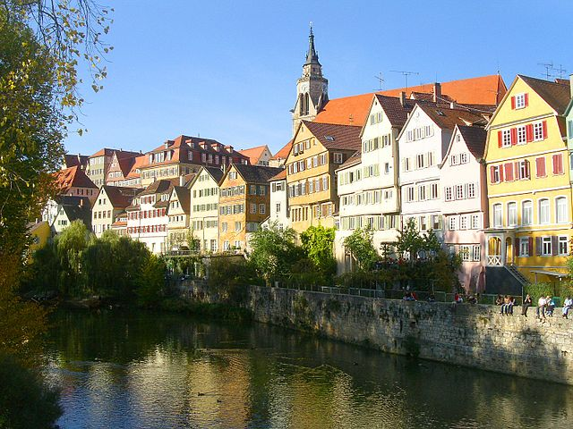||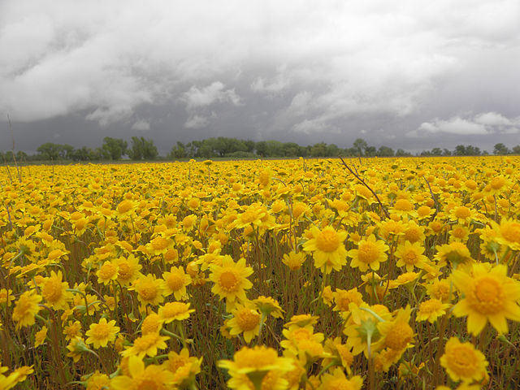|
|:---:|:---:|:---:|:---:|
||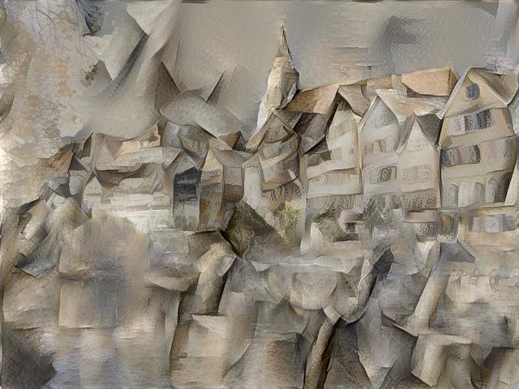 s 2e6, n 500| s 8e5, n 1000|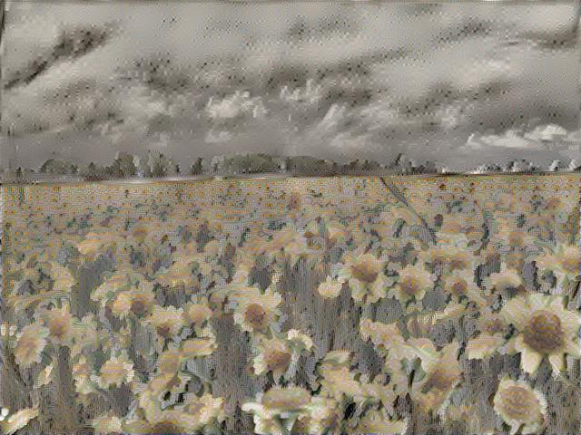 s 8e3, n 500|
|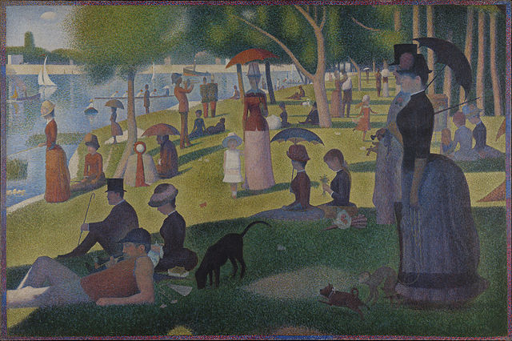|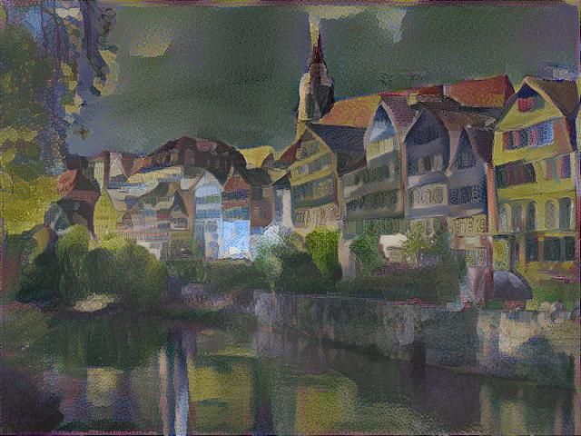 s 8e5, n 500|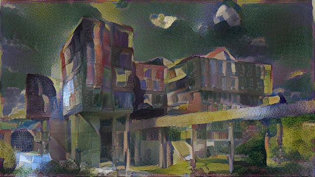 s 4e5, n 500|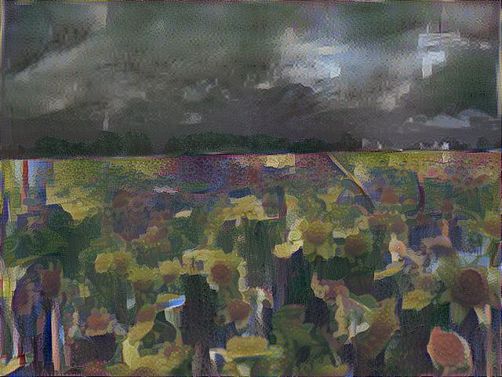 s 2e5, n 700|
|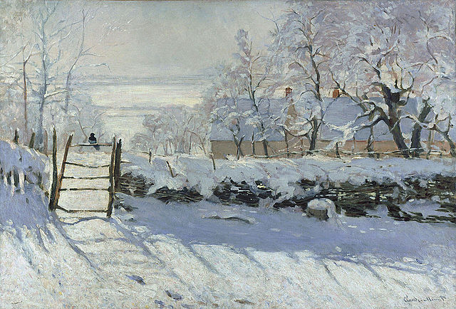|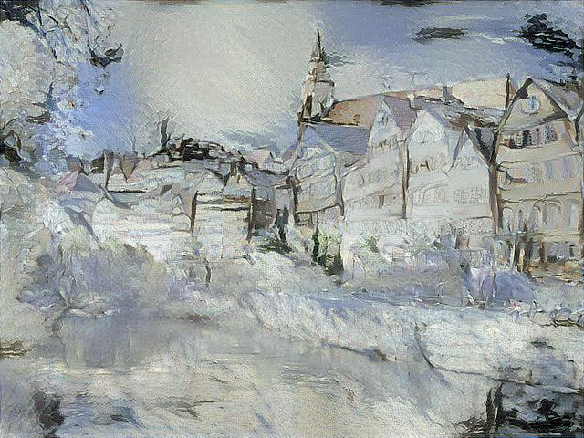 s 2e6, n 1000|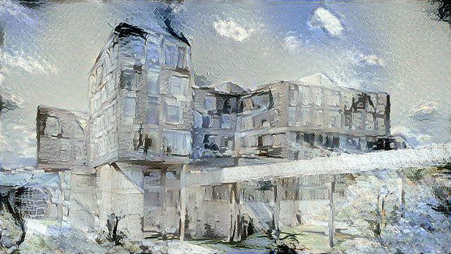 s 8e4, n 300|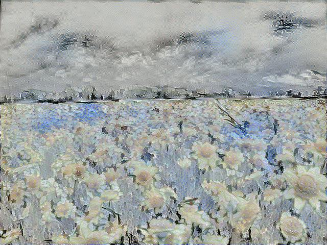 s 2e4, n 500|
|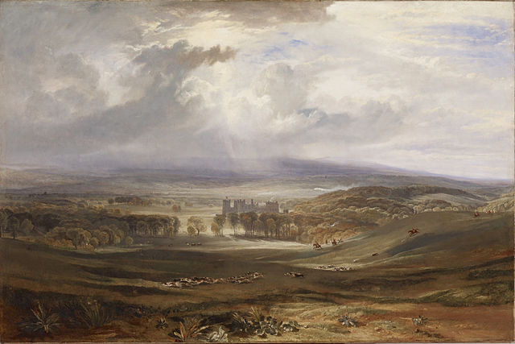|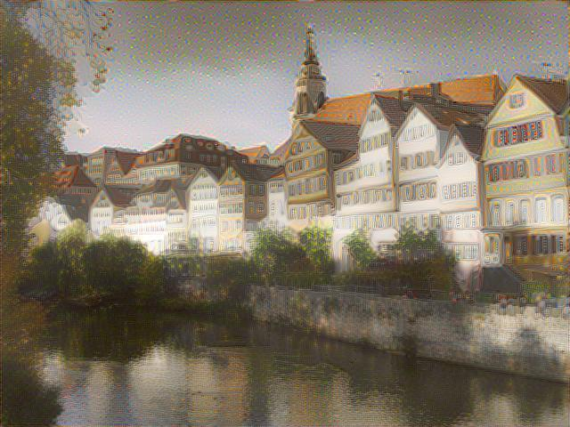 s 2e3, n 300|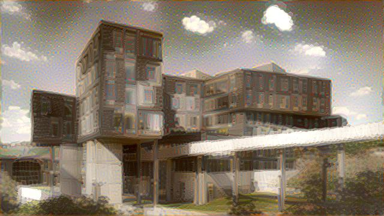 s 2e3, n 300|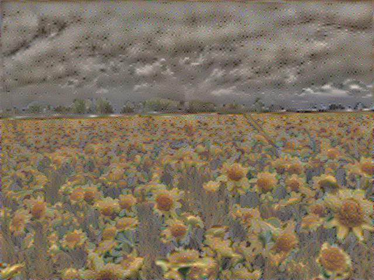 s 2e3, n 300|
||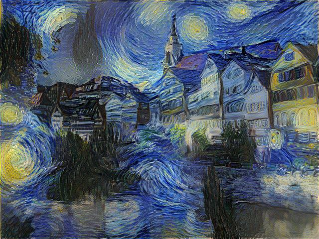 s 8e5, n 1000|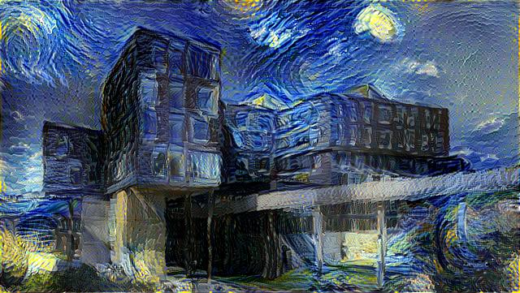 s 4e4, n 500|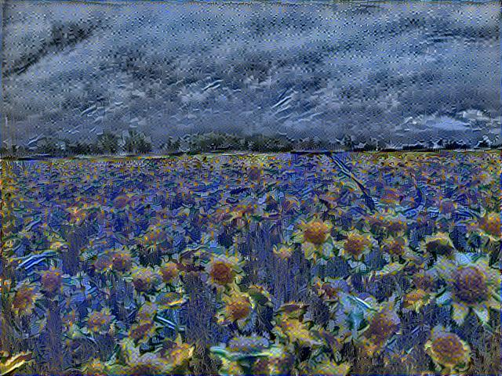 s 2e3, n 500|

||||
|:---:|:---:|:---:|
|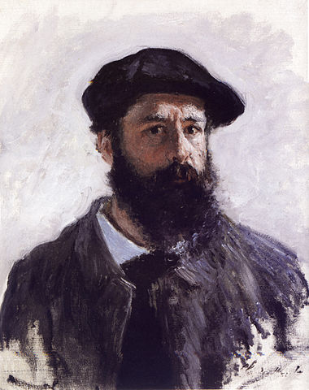|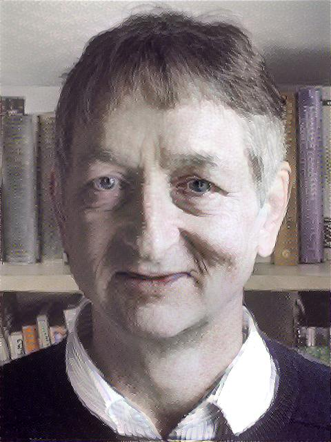 s 8e3, n 1000|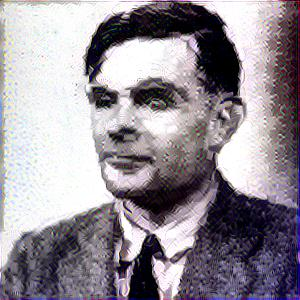 s 8e1, n 1000|
|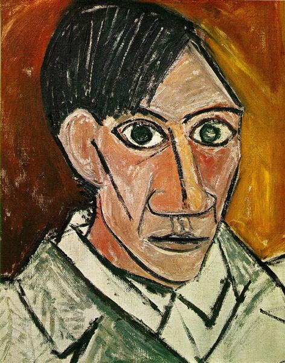|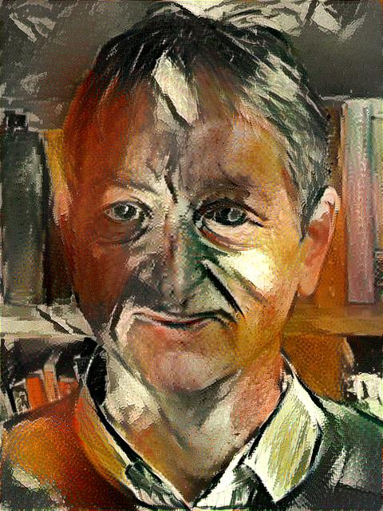 s 8e4, n 600|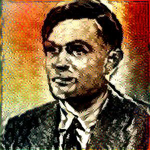 s 2e2, n 1000|
